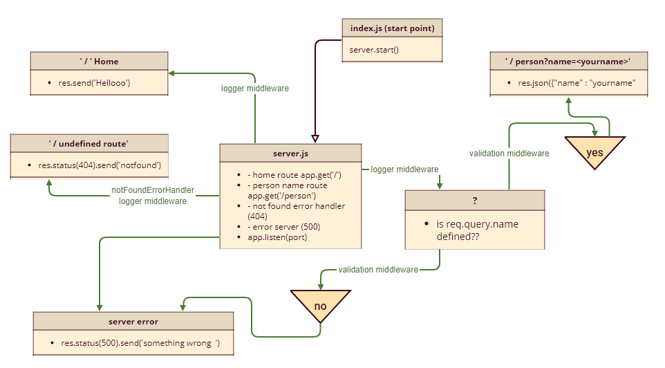

# Lab 2-401 course basic-express-server

## links:
- [heroku link](https://basic-express-server-faten.herokuapp.com/)

- [Github actions link](https://github.com/Fatensamman/basic-express-server/actions)

- [pull request link](https://github.com/Fatensamman/basic-express-server/pull/1)

## End Points
-  person name route *https://basic-express-server-faten.herokuapp.com/person?name=<yourname>*

## setup  environment

### Install
- initialization using  `npm inint -y`
- install libraries like express dotenv
- install devDependencies like jest supertest
- create files tree

### Test
- test 404 status  on a bad route
- test 500 status if no name in the query string
- test 200 status if the name is in the query string
test if given an name in the query string, the output object is correct
 using `npm test `
 - testing lint using `npm run lint`

 ## Documentation:
 
